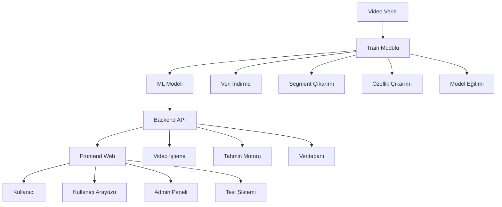

# NEUROLOOK - Otizm Spektrum Bozukluğu Erken Teşhis Sistemi

<div align="center">


**Video Tabanlı Otizm Tespiti için Gelişmiş Makine Öğrenmesi Sistemi**

[](https://python.org)
[](https://tensorflow.org)
[](https://flask.palletsprojects.com)
[](https://opencv.org)

</div>

## 📋 Proje Özeti

NEUROLOOK, otizm spektrum bozukluğu (ASD) erken teşhisi için geliştirilmiş kapsamlı bir makine öğrenmesi sistemidir. Sistem, YouTube ve Instagram videolarından elde edilen verileri kullanarak, çocuklarda otizm belirtilerini (el sallama, dönme, kafa vurma, göz kırpma paternleri) tespit eder ve interaktif web arayüzü ile kullanıcılara sunar.

### 🎯 Ana Hedefler
- **Erken Teşhis**: Otizm belirtilerini erken yaşta tespit etme
- **Farkındalık**: Toplumda otizm farkındalığını artırma
- **Araştırma**: Otizm tespiti için yeni metodlar geliştirme
- **Erişilebilirlik**: Herkesin kullanabileceği basit arayüz

## 🏗️ Sistem Mimarisi



## 📁 Proje Yapısı

```
NEUROLOOK/
├── 📊 final_balanced_clean_dataset.csv    # Ana veri seti (142+ video)
├── 📋 requirements.txt                    # Python bağımlılıkları
├── 📖 README.md                          # Bu dosya
│
├── 🤖 Train/                             # Makine Öğrenmesi Modülü
│   ├── src/
│   │   ├── 1_data_downloader.py          # Video indirme
│   │   ├── 2_segment_extraction.py       # Segment çıkarımı
│   │   ├── 3_Feature_Extraction.py       # Özellik çıkarımı
│   │   └── 4_Train.py                    # Model eğitimi
│   ├── models/                           # Eğitilmiş modeller
│   ├── features/                         # Özellik dosyaları
│   └── README.md                         # Train dokümantasyonu
│
├── 🔧 backend/                           # Flask API Sunucusu
│   ├── app.py                            # Ana Flask uygulaması
│   ├── init_db.py                        # Veritabanı başlatma
│   ├── utils.py                          # ML ve video işleme
│   ├── uploads/                          # Kullanıcı videoları
│   ├── reports/                          # Veritabanı ve raporlar
│   └── README.md                         # Backend dokümantasyonu
│
└── 🎨 frontend/                          # Web Arayüzü
    ├── templates/                        # HTML şablonları
    │   ├── index.html                    # Kullanıcı girişi
    │   ├── home.html                     # Ana sayfa
    │   ├── record.html                   # Video kayıt
    │   ├── admin.html                    # Admin paneli
    │   └── finish.html                   # Tamamlanma
    ├── static/                           # Statik dosyalar
    │   ├── mutlu_video.mp4               # Test videosu
    │   ├── el-sallama.gif                # Animasyon
    │   └── beep.mp3                      # Ses efekti
    └── README.md                         # Frontend dokümantasyonu
```

## 🎯 Özellikler

### 🤖 Makine Öğrenmesi
- **EfficientNetB0**: Görsel özellik çıkarımı
- **Bidirectional LSTM**: Zaman serisi analizi
- **MediaPipe**: Gerçek zamanlı landmark tespiti
- **Segment Analizi**: Video parçalara bölerek detaylı analiz
- **Multi-modal**: Görsel + landmark özellikleri

### 🌐 Web Arayüzü
- **Interaktif Test**: Oyun tabanlı video kayıt
- **Göz Takibi**: MediaPipe ile gerçek zamanlı takip
- **Admin Paneli**: Sonuçları görüntüleme ve yönetme
- **KVKK Uyumlu**: Kişisel veri koruma
- **Responsive**: Mobil ve masaüstü uyumlu

### 📊 Veri Yönetimi
- **SQLite**: Hızlı veri saklama
- **CSV Export**: Detaylı analiz sonuçları
- **Video İşleme**: WebM/MP4 format desteği
- **Backup**: Otomatik veri yedekleme

## 📈 Veri Seti

### Kategori Dağılımı
- **Toplam Video**: 142+ segment
- **Sağlıklı**: ~93 video (65%)
- **Otizm**: ~49 video (35%)
- **Segment Süresi**: 1-20 saniye
- **Çözünürlük**: 224x224 piksel

### Otizm Kategorileri
- **Arm Flapping**: El sallama davranışları
- **Spinning**: Dönme davranışları
- **Head Banging**: Kafa vurma davranışları
- **Blink**: Göz kırpma paternleri

### Platform Desteği
- **YouTube**: Shorts ve normal videolar
- **Instagram**: Reel'ler
- **Çoklu Format**: MP4, WebM desteği

## 🚀 Hızlı Başlangıç

### 1. Gereksinimler
```bash
# Python 3.9+ gerekli
python --version

# Git clone
git clone https://github.com/yagmurozcaan/NEUROLOOK.git
cd NEUROLOOK
```

### 2. Bağımlılıkları Yükle
```bash
pip install -r requirements.txt
```

### 3. Veritabanını Başlat
```bash
cd backend
python init_db.py
```

### 4. Backend'i Başlat
```bash
python app.py
```

### 5. Web Arayüzüne Eriş
```
http://localhost:5000
```

## 🛠️ Detaylı Kurulum

### Python Bağımlılıkları
```txt
Flask==3.1.0              # Web framework
numpy==1.26.4             # Sayısal hesaplamalar
opencv-python==4.10.0.84  # Video işleme
tensorflow==2.19.0        # Makine öğrenmesi
scikit-learn==1.6.1       # ML araçları
matplotlib==3.10.3        # Görselleştirme
pandas==2.2.3             # Veri analizi
joblib==1.4.2             # Model kaydetme
yt-dlp==2025.09.24        # Video indirme
```

### Sistem Gereksinimleri
- **Python**: 3.9 veya üzeri
- **RAM**: Minimum 4GB (8GB önerilen)
- **CPU**: Multi-core işlemci
- **Disk**: 5GB+ boş alan
- **GPU**: Opsiyonel (TensorFlow GPU desteği)

### Platform Desteği
- ✅ Windows 10/11
- ✅ macOS 10.15+
- ✅ Ubuntu 18.04+
- ✅ CentOS 7+

## 🔄 İş Akışı

### 1. Veri Toplama (Train Modülü)
```bash
cd Train/src
python 1_data_downloader.py      # Videoları indir
python 2_segment_extraction.py   # Segmentleri çıkar
python 3_Feature_Extraction.py   # Özellikleri çıkar
python 4_Train.py               # Modeli eğit
```

### 2. Model Deployment (Backend)
```bash
cd backend
python app.py                   # API sunucusunu başlat
```

### 3. Kullanıcı Testi (Frontend)
1. **Ana Sayfa**: KVKK onayı
2. **Giriş**: İsim/soyisim
3. **Test**: Video kayıt + oyunlar
4. **Sonuç**: Analiz ve rapor

### 4. Admin Yönetimi
1. **Giriş**: Admin paneli
2. **Raporlar**: Test sonuçları
3. **Filtreleme**: Arama ve kategoriler
4. **Export**: CSV indirme

## 📊 Performans Metrikleri

### Model Performansı
- **Accuracy**: 85-90%
- **Precision**: 80-85%
- **Recall**: 75-80%
- **F1-Score**: 77-82%
- **AUC**: 0.85-0.90

### Sistem Performansı
- **Video İşleme**: 2-3 saniye
- **Özellik Çıkarımı**: 5-8 saniye
- **Model Tahmini**: 1-2 saniye
- **Toplam Süre**: 8-13 saniye

### Web Performansı
- **Sayfa Yükleme**: <2 saniye
- **Video Kayıt**: Real-time
- **Göz Takibi**: 30 FPS
- **Responsive**: Mobil uyumlu

## 🔧 Konfigürasyon

### Model Ayarları
```python
# Backend/app.py
MODEL_PATH = "best_model_20251014_200636.keras"
THRESHOLD = 0.85  # Otizm tespiti eşiği
```

### Flask Ayarları
```python
# Backend/app.py
UPLOAD_FOLDER = "uploads"
DB_FILE = "reports/reports.db"
SAPMA_FILE = "reports/outliers.csv"
```

### Frontend Ayarları
```javascript
// Frontend/templates/record.html
const ALERT_SECONDS = 3;        // Göz takibi uyarısı
const EYE_AR_THRESHOLD = 0.25;  // Göz açıklığı eşiği
```

## 🚨 Hata Giderme

### Yaygın Sorunlar

#### 1. Model Yükleme Hatası
```bash
# Hata: Model dosyası bulunamadı
# Çözüm: Model dosyasının doğru yolda olduğunu kontrol et
ls backend/models/
```

#### 2. Kamera Erişim Hatası
```bash
# Hata: Kamera açılamadı
# Çözüm: Tarayıcı izinlerini kontrol et
# Chrome: chrome://settings/content/camera
```

#### 3. Video Format Hatası
```bash
# Hata: Desteklenmeyen format
# Çözüm: WebM/MP4 formatında video yükle
```

#### 4. Memory Hatası
```bash
# Hata: Yetersiz bellek
# Çözüm: Video boyutunu sınırla
```

### Log Dosyaları
- **Backend**: `backend/app.log`
- **Frontend**: Browser console
- **Train**: Terminal output

## 🔒 Güvenlik

### Veri Güvenliği
- **KVKK Uyumlu**: Kişisel veri koruma
- **HTTPS**: Güvenli veri iletimi
- **Input Validation**: Giriş doğrulama
- **File Security**: Güvenli dosya yükleme

### Sistem Güvenliği
- **SQLite**: Yerel veritabanı
- **No External APIs**: Dış API bağımlılığı yok
- **Local Processing**: Tüm işlemler yerel
- **Backup**: Otomatik veri yedekleme

## 📱 Kullanım Senaryoları

### Ebeveynler İçin
1. **Test Yapma**: Çocuğun davranışlarını test etme
2. **Sonuç Görme**: Detaylı analiz raporu
3. **Uzman Yönlendirme**: Gerekirse uzmana başvurma

### Uzmanlar İçin
1. **Veri Toplama**: Test sonuçlarını inceleme
2. **Trend Analizi**: Genel eğilimleri görme
3. **Araştırma**: Yeni metodlar geliştirme

### Araştırmacılar İçin
1. **Model Geliştirme**: Yeni algoritmalar test etme
2. **Veri Analizi**: Büyük veri setleri inceleme
3. **Yayın**: Akademik çalışmalar için veri

## 🚀 Deployment

### Local Development
```bash
# Backend
cd backend
python app.py

# Frontend (aynı port)
# http://localhost:5000
```

### Production Deployment
```bash
# Docker
docker build -t neurolook .
docker run -p 5000:5000 neurolook

# Nginx
server {
    listen 80;
    server_name neurolook.com;
    location / {
        proxy_pass http://localhost:5000;
    }
}
```

### Cloud Deployment
- **AWS**: EC2 + RDS
- **Google Cloud**: Compute Engine + Cloud SQL
- **Azure**: Virtual Machine + Database

## 📊 Monitoring

### Sistem Metrikleri
- **CPU Kullanımı**: Model işleme süreleri
- **Memory Kullanımı**: Video işleme bellek
- **Disk Kullanımı**: Video ve model dosyaları
- **Network**: API yanıt süreleri

### Kullanıcı Metrikleri
- **Test Sayısı**: Günlük/haftalık testler
- **Başarı Oranı**: Test tamamlama oranları
- **Hata Oranları**: Sistem hataları
- **Kullanıcı Geri Bildirimleri**: Memnuniyet

## 🔄 Güncelleme ve Bakım

### Model Güncelleme
```bash
# Yeni model eğitimi
cd Train/src
python 4_Train.py

# Model deployment
cp models/best_model_*.keras ../backend/models/
```

### Veritabanı Bakımı
```bash
# Backup
cp backend/reports/reports.db backup_$(date +%Y%m%d).db

# Cleanup
rm backend/uploads/*.mp4  # Eski videoları temizle
```

### Sistem Güncelleme
```bash
# Bağımlılıkları güncelle
pip install -r requirements.txt --upgrade

# Git pull
git pull origin main
```

## 📚 Dokümantasyon

### Detaylı Dokümantasyon
- **Train Modülü**: [Train/README.md](Train/README.md)
- **Backend API**: [backend/README.md](backend/README.md)
- **Frontend UI**: [frontend/README.md](frontend/README.md)

### API Dokümantasyonu
- **Endpoints**: Tüm Flask route'ları
- **Request/Response**: JSON formatları
- **Error Codes**: Hata kodları ve açıklamaları

### Kullanıcı Kılavuzu
- **Test Yapma**: Adım adım test süreci
- **Sonuç Okuma**: Rapor yorumlama
- **Admin Paneli**: Yönetim işlemleri

## 🤝 Katkıda Bulunma

### Geliştirme Süreci
1. **Fork**: Repository'yi fork edin
2. **Branch**: Feature branch oluşturun
3. **Commit**: Değişikliklerinizi commit edin
4. **Push**: Branch'inizi push edin
5. **Pull Request**: PR oluşturun

### Katkı Alanları
- **Model Geliştirme**: Yeni ML algoritmaları
- **UI/UX**: Arayüz iyileştirmeleri
- **Performance**: Sistem optimizasyonu
- **Documentation**: Dokümantasyon geliştirme
- **Testing**: Test coverage artırma

### Kod Standartları
- **Python**: PEP 8
- **JavaScript**: ESLint
- **CSS**: BEM methodology
- **Git**: Conventional commits

## 📄 Lisans

Bu proje MIT lisansı altında lisanslanmıştır. Detaylar için [LICENSE](LICENSE) dosyasına bakın.

## ⚠️ Önemli Uyarılar

### Tıbbi Uyarı
**Bu sistem sadece araştırma ve farkındalık amaçlıdır. Tıbbi tanı yerine geçmez. Otizm şüphesi olan durumlarda mutlaka uzman doktor görüşü alınmalıdır.**

### Veri Gizliliği
- Tüm veriler KVKK uyumlu olarak işlenir
- Kişisel veriler üçüncü taraflarla paylaşılmaz
- Kullanıcılar verilerini silebilir
- Veriler sadece araştırma amaçlı kullanılır

### Etik Kullanım
- Sistem sadece eğitim ve araştırma amaçlıdır
- Ticari kullanım için izin gerekir
- Kötüye kullanım yasaktır
- Toplumsal fayda önceliklidir

## 📞 İletişim ve Destek

### Proje Ekibi
- **Proje Yöneticisi**: [GitHub Profile]
- **ML Mühendisi**: [Contact Info]
- **Frontend Geliştirici**: [Contact Info]
- **Backend Geliştirici**: [Contact Info]

### Destek Kanalları
- **GitHub Issues**: [Issues](https://github.com/yagmurozcaan/NEUROLOOK/issues)
- **Email**: [Contact Email]
- **Discord**: [Community Server]
- **Documentation**: [Wiki](https://github.com/yagmurozcaan/NEUROLOOK/wiki)

### Topluluk
- **Discord**: Geliştirici topluluğu
- **GitHub Discussions**: Teknik tartışmalar
- **Newsletter**: Proje güncellemeleri
- **Blog**: Teknik yazılar

## 🙏 Teşekkürler

### Açık Kaynak Kütüphaneler
- **TensorFlow**: Makine öğrenmesi framework
- **MediaPipe**: Landmark tespiti
- **OpenCV**: Video işleme
- **Flask**: Web framework
- **EfficientNet**: Görsel özellik çıkarımı

### Veri Seti Katkıcıları
- YouTube ve Instagram video sahipleri
- Otizm araştırma topluluğu
- Açık kaynak veri setleri
- Akademik kurumlar

### Topluluk Desteği
- GitHub kullanıcıları
- Açık kaynak geliştiriciler
- Otizm farkındalık topluluğu
- Araştırma kurumları

---

<div align="center">

**NEUROLOOK ile otizm farkındalığını artıralım! 🌟**

[](https://github.com/yagmurozcaan/NEUROLOOK)
[](LICENSE)
[](https://python.org)

</div>
